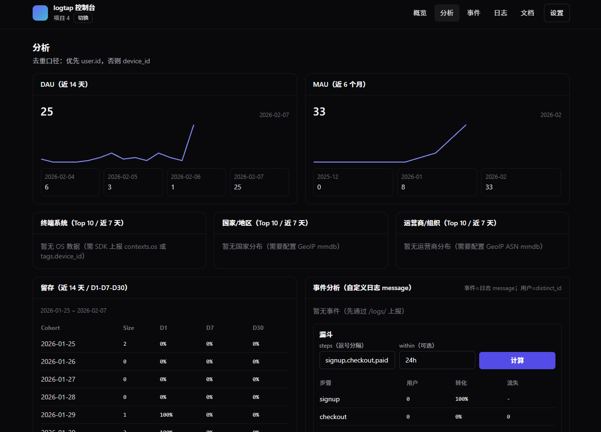
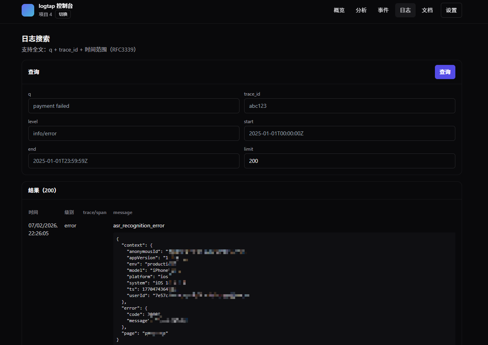

# logtap

[](go.mod)
[](https://gin-gonic.com/)
[](https://www.postgresql.org/)
[](https://redis.io/)
[](web/)
[](web/)

轻量化的 Sentry 兼容上报 + 自定义结构化日志网关（Go + Gin + NSQ + TimescaleDB/Postgres）。

适合用来快速搭建：
- Sentry SDK 兼容的错误/事件上报入口（`/store` + `/envelope`）
- 结构化日志采集（批量 + gzip）与检索
- 基础分析（DAU/MAU、分布、留存、事件 Top、漏斗）

## 关键特性

- Sentry 兼容上报：`/api/:projectId/store/`、`/api/:projectId/envelope/`
- 自定义结构化日志：`/api/:projectId/logs/`（批量 JSON、gzip）
- 事件/埋点：`/api/:projectId/track/`（用于事件 Top/漏斗分析）
- 异步写库：HTTP → NSQ → 消费者批量写入 Postgres/Timescale
- 控制台：`web/`（React + Tailwind）
- 可选增强：Redis 指标/聚合、GeoIP 分布

## 快速开始（Docker Compose）

前提：已安装 Docker + Docker Compose。

1) 生成 `AUTH_SECRET`（base64，解码后长度 >= 32 bytes）：
- Taskfile：`task auth:secret`
- Bash：`bash scripts/gen-auth-secret.sh`
- PowerShell：`powershell -ExecutionPolicy Bypass -File scripts/gen-auth-secret.ps1`

2) （可选）启用 GeoIP（国家/城市/运营商分布）
- 需要 MaxMind GeoLite2 下载密钥：设置 `MAXMIND_LICENSE_KEY`（见 `.env.example`）
- Docker Compose 会在构建/启动时自动下载 mmdb 到 `/data/geoip/`（挂载为 volume）

3) 启动：

```bash
cd deploy
docker compose up --build
```

4) 访问：
- API/控制台：`http://localhost:8080`

## 截图




## 配置（env）

环境变量示例见：`.env.example`。

常用/关键项：
- `AUTH_SECRET` / `AUTH_SECRET_FILE`：必需（控制台登录、项目管理、查询鉴权）
- `POSTGRES_URL`：`RUN_CONSUMERS=true` 时必需（消费者写库）
- `DB_REQUIRE_TIMESCALE`：可选（`true` 时强制 TimescaleDB 可用并创建 hypertable，推荐生产/云端）
- `REDIS_ADDR`：可选（指标/分析与云端能力会用到）

## 文档

- 项目概览：`docs/OVERVIEW.md`
- 部署说明：`docs/DEPLOYMENT.md`
- 上报协议与模型：`docs/INGEST.md`
- SDK 快速开始：`docs/SDKs.md`（规范：`docs/SDK_SPEC.md`）
- 性能/技术说明：`docs/PERFORMANCE_TECH_SPEC.md`

运行后可查看 OpenAPI：
- `GET /openapi.json`
- `GET /docs`

## 基本调用示例

```bash
LOGTAP_BASE="http://localhost:8080"
PROJECT_ID="1"
PROJECT_KEY="pk_xxx"

# 上报日志
curl -sS -X POST "$LOGTAP_BASE/api/$PROJECT_ID/logs/" \
  -H "Content-Type: application/json" \
  -H "X-Project-Key: $PROJECT_KEY" \
  -d '{"level":"info","message":"hello","fields":{"k":"v"}}'
```

## 开发

- 后端：`task run` 或 `go run ./cmd/gateway`
- 前端：`cd web && bun install && bun run dev`（或 `npm install && npm run dev`）
