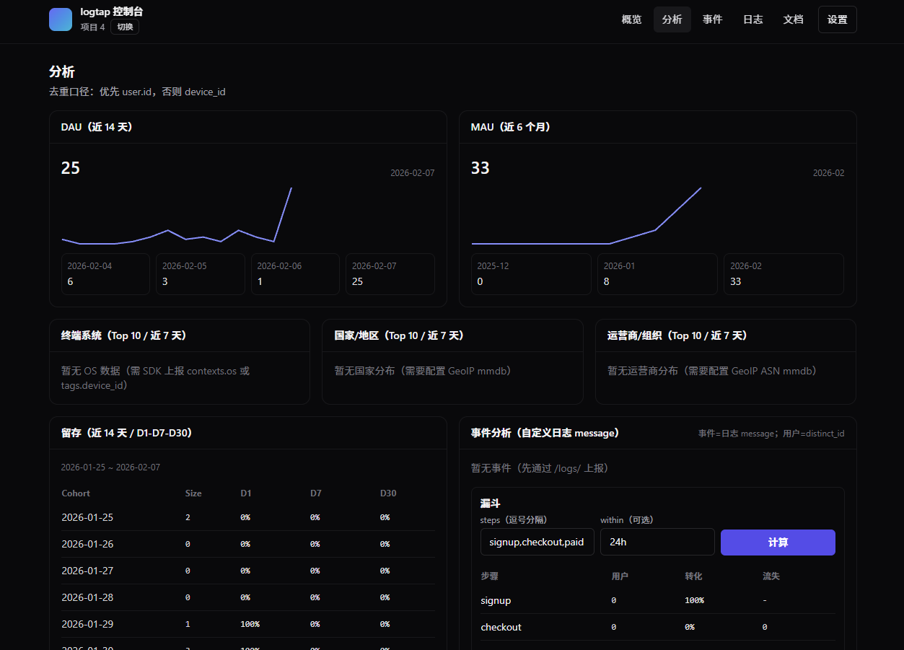
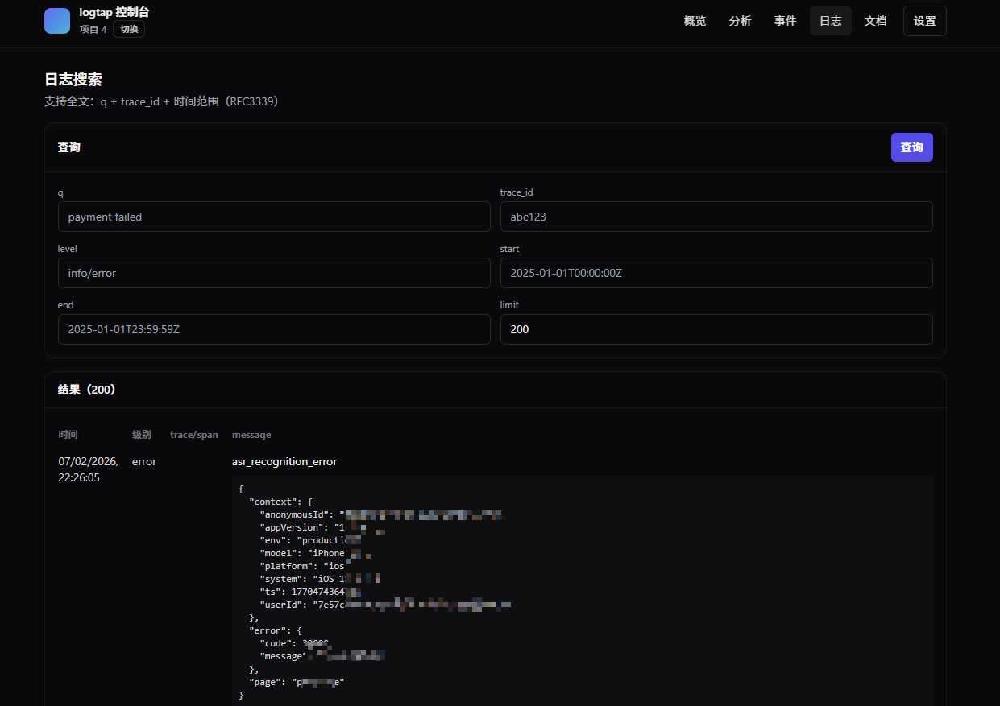

# logtap

[](go.mod)
[](https://gin-gonic.com/)
[](https://www.postgresql.org/)
[](https://redis.io/)
[](web/)
[](web/)

**[中文文档](#logtap-中文)**

A lightweight Sentry-compatible error reporting and structured logging gateway (Go + Gin + NSQ + TimescaleDB/Postgres).

Great for quickly setting up:
- Sentry SDK compatible error/event reporting (`/store` + `/envelope`)
- Structured log collection (batch + gzip) and search
- Basic analytics (DAU/MAU, distribution, retention, event top, funnel)

## Key Features

- Sentry compatible reporting: `/api/:projectId/store/`, `/api/:projectId/envelope/`
- Custom structured logs: `/api/:projectId/logs/` (batch JSON, gzip)
- Events/tracking: `/api/:projectId/track/` (for event top/funnel analysis)
- Async DB writes: HTTP → NSQ → consumer batch write to Postgres/Timescale
- Console: `web/` (React + Tailwind)
- Optional enhancements: Redis metrics/aggregation, GeoIP distribution

## Quick Start (Docker Compose)

Prerequisites: Docker + Docker Compose installed.

1) Generate `AUTH_SECRET` (base64, decoded length >= 32 bytes):
- Taskfile: `task auth:secret`
- Bash: `bash scripts/gen-auth-secret.sh`
- PowerShell: `powershell -ExecutionPolicy Bypass -File scripts/gen-auth-secret.ps1`

2) (Optional) Enable GeoIP (country/city/ASN distribution)
- Requires MaxMind GeoLite2 license key: set `MAXMIND_LICENSE_KEY` (see `.env.example`)
- Docker Compose will download mmdb to `/data/geoip/` at build/start (mounted as volume)

3) Start:

```bash
cd deploy
docker compose up --build
```

4) Access:
- API/Console: `http://localhost:8080`

## Screenshots




## Configuration (Environment Variables)

See `.env.example` for a complete example.

### Required

| Variable | Description | Default |
|----------|-------------|---------|
| `AUTH_SECRET` | **Required**. Secret for console login, project management, query auth. Base64 encoded, decoded length >= 32 bytes. See "Quick Start" for generation. | - |
| `NSQD_ADDRESS` | NSQd TCP address. Usually no need to change in Docker Compose. | `127.0.0.1:4150` |
| `POSTGRES_URL` | PostgreSQL connection string. Required when `RUN_CONSUMERS=true`. | - |

### Service Basics

| Variable | Description | Default |
|----------|-------------|---------|
| `HTTP_ADDR` | HTTP server listen address. | `:8080` |
| `NSQD_HTTP_ADDRESS` | NSQd HTTP address. Auto-derived from `NSQD_ADDRESS` (port+1) if empty. | Auto |
| `RUN_CONSUMERS` | Start NSQ consumers (DB writes). Set to `false` for API-only gateway. | `true` |
| `RUN_ALERT_WORKER` | Start alert worker. Set to `false` to enqueue alerts without delivery, run `alert-worker` separately. | `false` |
| `MAINTENANCE_MODE` | Maintenance mode. Rejects writes when `true`. Useful during DB migrations. | `false` |
| `ENABLE_DEBUG_ENDPOINTS` | Enable debug endpoints (pprof, etc.). | `false` |

### Database Connection

| Variable | Description | Default |
|----------|-------------|---------|
| `DB_REQUIRE_TIMESCALE` | Require TimescaleDB and create hypertables. Recommended for production. | `false` |
| `DB_MAX_OPEN_CONNS` | Max open DB connections. | `10` |
| `DB_MAX_IDLE_CONNS` | Max idle DB connections. | `1` |

### NSQ Consumer Tuning

| Variable | Description | Default |
|----------|-------------|---------|
| `NSQ_MAX_IN_FLIGHT` | Max in-flight messages. | `200` |
| `NSQ_EVENT_CHANNEL` | Event consumer channel name. | `event-consumer` |
| `NSQ_LOG_CHANNEL` | Log consumer channel name. | `log-consumer` |
| `NSQ_EVENT_CONCURRENCY` | Event consumer concurrency. | `1` |
| `NSQ_LOG_CONCURRENCY` | Log consumer concurrency. | `1` |

### Batch Write Tuning

| Variable | Description | Default |
|----------|-------------|---------|
| `DB_LOG_BATCH_SIZE` | Log batch write size. | `200` |
| `DB_LOG_FLUSH_INTERVAL` | Log flush interval. | `50ms` |
| `DB_EVENT_BATCH_SIZE` | Event batch write size. | `200` |
| `DB_EVENT_FLUSH_INTERVAL` | Event flush interval. | `50ms` |

### Data Cleanup

| Variable | Description | Default |
|----------|-------------|---------|
| `CLEANUP_INTERVAL` | Cleanup task interval. | `10m` |
| `CLEANUP_POLICY_LIMIT` | Max policies per cleanup run. | `50` |
| `CLEANUP_DELETE_BATCH_SIZE` | Rows per delete batch. | `5000` |
| `CLEANUP_MAX_BATCHES` | Max batches (prevent long cleanup). | `50` |
| `CLEANUP_BATCH_SLEEP` | Sleep between batches. | `0s` |

### Redis (Optional)

| Variable | Description | Default |
|----------|-------------|---------|
| `REDIS_ADDR` | Redis address. Enables metrics aggregation and enhanced analytics. | - |
| `REDIS_PASSWORD` | Redis password. | - |
| `REDIS_DB` | Redis database number. | `0` |
| `ENABLE_METRICS` | Enable metrics (requires Redis). | `true` (when Redis available) |
| `METRICS_DAY_TTL` | Day-level metrics retention. | `4320h` (180 days) |
| `METRICS_DIST_TTL` | Distribution metrics retention. | `2160h` (90 days) |
| `METRICS_MONTH_TTL` | Month-level metrics retention. | `13392h` (~18 months) |

### GeoIP (Optional)

| Variable | Description | Default |
|----------|-------------|---------|
| `GEOIP_CITY_MMDB` | GeoIP City database path. Default in Docker: `/data/geoip/GeoLite2-City.mmdb`. | - |
| `GEOIP_ASN_MMDB` | GeoIP ASN database path. Default in Docker: `/data/geoip/GeoLite2-ASN.mmdb`. | - |
| `MAXMIND_LICENSE_KEY` | MaxMind license key (downloads GeoIP at build time). | - |

### Authentication & Session

| Variable | Description | Default |
|----------|-------------|---------|
| `AUTH_SECRET` | Auth secret (Base64, >= 32 bytes). | **Required** |
| `AUTH_SECRET_FILE` | Read auth secret from file (Docker Secret). | - |
| `AUTH_TOKEN_TTL` | Auth token TTL. | `168h` (7 days) |

### Alerting

#### Alert Worker

| Variable | Description | Default |
|----------|-------------|---------|
| `RUN_ALERT_WORKER` | Start alert delivery worker. | `false` |
| `ALERT_CLEANUP_INTERVAL` | Alert history cleanup interval. | `1h` |
| `ALERT_DELIVERIES_RETENTION_DAYS` | Alert delivery records retention days (0=disabled). | `0` |
| `ALERT_STATES_RETENTION_DAYS` | Alert state records retention days (0=disabled). | `0` |

#### Webhook SSRF Protection

| Variable | Description | Default |
|----------|-------------|---------|
| `WEBHOOK_ALLOW_LOOPBACK` | Allow webhook calls to loopback (127.0.0.1). For dev/test. | `false` |
| `WEBHOOK_ALLOW_PRIVATE_IPS` | Allow webhook calls to private IPs (10.x, 172.16-31.x, 192.168.x). | `false` |
| `WEBHOOK_ALLOWLIST_CIDRS` | Allowed CIDR list, comma/space separated. E.g., `10.0.0.0/8,192.168.0.0/16`. | - |

#### SMTP Email

| Variable | Description | Default |
|----------|-------------|---------|
| `SMTP_HOST` | SMTP server address. | - |
| `SMTP_PORT` | SMTP port. | `587` |
| `SMTP_FROM` | Sender email address. | - |
| `SMTP_USERNAME` | SMTP username. | - |
| `SMTP_PASSWORD` | SMTP password. | - |

#### SMS (Aliyun)

| Variable | Description | Default |
|----------|-------------|---------|
| `SMS_PROVIDER` | SMS provider: `aliyun` or `tencent`. | - |
| `ALIYUN_SMS_ACCESS_KEY_ID` | Aliyun AccessKey ID. | - |
| `ALIYUN_SMS_ACCESS_KEY_SECRET` | Aliyun AccessKey Secret. | - |
| `ALIYUN_SMS_SIGN_NAME` | SMS signature. | - |
| `ALIYUN_SMS_TEMPLATE_CODE` | SMS template code. | - |
| `ALIYUN_SMS_REGION` | Aliyun region. | `cn-hangzhou` |

#### SMS (Tencent Cloud)

| Variable | Description | Default |
|----------|-------------|---------|
| `TENCENT_SMS_SECRET_ID` | Tencent Cloud SecretId. | - |
| `TENCENT_SMS_SECRET_KEY` | Tencent Cloud SecretKey. | - |
| `TENCENT_SMS_APP_ID` | SMS AppId. | - |
| `TENCENT_SMS_SIGN_NAME` | SMS signature. | - |
| `TENCENT_SMS_TEMPLATE_ID` | SMS template ID. | - |
| `TENCENT_SMS_REGION` | Tencent Cloud region. | `ap-guangzhou` |

### Monitor Worker (Optional)

| Variable | Description | Default |
|----------|-------------|---------|
| `RUN_MONITOR_WORKER` | Start monitor worker (health checks, metrics). | `false` |
| `MONITOR_TICK_INTERVAL` | Monitor tick interval. | `2s` |
| `MONITOR_BATCH_SIZE` | Monitor batch size. | `20` |
| `MONITOR_LEASE_DURATION` | Monitor lease duration (distributed). | `60s` |

### Cloud Proxy (Optional)

| Variable | Description | Default |
|----------|-------------|---------|
| `LOGTAP_PROXY_SECRET` | Cloud proxy secret. When set, `/api/:projectId/*` requires `X-Logtap-Proxy-Secret` header. | - |

### Plugins (Optional)

| Variable | Description | Default |
|----------|-------------|---------|
| `DETECTOR_PLUGIN_DIRS` | Detector plugin directories, comma/space separated. | - |

## Documentation

- Overview: `docs/OVERVIEW.md`
- Deployment: `docs/DEPLOYMENT.md`
- Ingest protocol: `docs/INGEST.md`
- SDK quick start: `docs/SDKs.md` (spec: `docs/SDK_SPEC.md`)
- Performance: `docs/PERFORMANCE_TECH_SPEC.md`

OpenAPI after running:
- `GET /openapi.json`
- `GET /docs`

## Example Usage

```bash
LOGTAP_BASE="http://localhost:8080"
PROJECT_ID="1"
PROJECT_KEY="pk_xxx"

# Send log
curl -sS -X POST "$LOGTAP_BASE/api/$PROJECT_ID/logs/" \
  -H "Content-Type: application/json" \
  -H "X-Project-Key: $PROJECT_KEY" \
  -d '{"level":"info","message":"hello","fields":{"k":"v"}}'
```

## Development

- Backend: `task run` or `go run ./cmd/gateway`
- Frontend: `cd web && bun install && bun run dev` (or `npm install && npm run dev`)

---

# logtap 中文

[](go.mod)
[](https://gin-gonic.com/)
[](https://www.postgresql.org/)
[](https://redis.io/)
[](web/)
[](web/)

**[English](#logtap)**

轻量化的 Sentry 兼容上报 + 自定义结构化日志网关（Go + Gin + NSQ + TimescaleDB/Postgres）。

适合用来快速搭建：
- Sentry SDK 兼容的错误/事件上报入口（`/store` + `/envelope`）
- 结构化日志采集（批量 + gzip）与检索
- 基础分析（DAU/MAU、分布、留存、事件 Top、漏斗）

## 关键特性

- Sentry 兼容上报：`/api/:projectId/store/`、`/api/:projectId/envelope/`
- 自定义结构化日志：`/api/:projectId/logs/`（批量 JSON、gzip）
- 事件/埋点：`/api/:projectId/track/`（用于事件 Top/漏斗分析）
- 异步写库：HTTP → NSQ → 消费者批量写入 Postgres/Timescale
- 控制台：`web/`（React + Tailwind）
- 可选增强：Redis 指标/聚合、GeoIP 分布

## 快速开始（Docker Compose）

前提：已安装 Docker + Docker Compose。

1) 生成 `AUTH_SECRET`（base64，解码后长度 >= 32 bytes）：
- Taskfile：`task auth:secret`
- Bash：`bash scripts/gen-auth-secret.sh`
- PowerShell：`powershell -ExecutionPolicy Bypass -File scripts/gen-auth-secret.ps1`

2) （可选）启用 GeoIP（国家/城市/运营商分布）
- 需要 MaxMind GeoLite2 下载密钥：设置 `MAXMIND_LICENSE_KEY`（见 `.env.example`）
- Docker Compose 会在构建/启动时自动下载 mmdb 到 `/data/geoip/`（挂载为 volume）

3) 启动：

```bash
cd deploy
docker compose up --build
```

4) 访问：
- API/控制台：`http://localhost:8080`

## 配置（环境变量）

环境变量示例见：`.env.example`。

### 必需配置

| 变量 | 说明 | 默认值 |
|------|------|--------|
| `AUTH_SECRET` | **必需**。控制台登录、项目管理、查询鉴权的密钥。Base64 编码，解码后 >= 32 字节。生成方式见上方"快速开始"。 | - |
| `NSQD_ADDRESS` | NSQd TCP 地址。Docker Compose 环境下通常不需要改。 | `127.0.0.1:4150` |
| `POSTGRES_URL` | PostgreSQL 连接串。`RUN_CONSUMERS=true` 时必需。 | - |

### 服务基础

| 变量 | 说明 | 默认值 |
|------|------|--------|
| `HTTP_ADDR` | HTTP 服务监听地址。 | `:8080` |
| `NSQD_HTTP_ADDRESS` | NSQd HTTP 地址。若为空则自动从 `NSQD_ADDRESS` 推导（端口+1）。 | 自动推导 |
| `RUN_CONSUMERS` | 是否启动 NSQ 消费者（写库）。设为 `false` 时仅运行 API 网关。 | `true` |
| `RUN_ALERT_WORKER` | 是否启动告警 Worker。设为 `false` 时告警入队但不投递，需单独运行 `alert-worker`。 | `false` |
| `MAINTENANCE_MODE` | 维护模式。为 `true` 时拒绝写入，适合数据库迁移期间使用。 | `false` |
| `ENABLE_DEBUG_ENDPOINTS` | 启用调试端点（pprof 等）。 | `false` |

### 数据库连接

| 变量 | 说明 | 默认值 |
|------|------|--------|
| `DB_REQUIRE_TIMESCALE` | 为 `true` 时强制要求 TimescaleDB 可用并创建 hypertable。推荐生产环境开启。 | `false` |
| `DB_MAX_OPEN_CONNS` | 数据库最大打开连接数。 | `10` |
| `DB_MAX_IDLE_CONNS` | 数据库最大空闲连接数。 | `1` |

### NSQ 消费者调优

| 变量 | 说明 | 默认值 |
|------|------|--------|
| `NSQ_MAX_IN_FLIGHT` | NSQ 最大并行处理消息数。 | `200` |
| `NSQ_EVENT_CHANNEL` | 事件消费 channel 名称。 | `event-consumer` |
| `NSQ_LOG_CHANNEL` | 日志消费 channel 名称。 | `log-consumer` |
| `NSQ_EVENT_CONCURRENCY` | 事件消费并发数。 | `1` |
| `NSQ_LOG_CONCURRENCY` | 日志消费并发数。 | `1` |

### 批量写入调优

| 变量 | 说明 | 默认值 |
|------|------|--------|
| `DB_LOG_BATCH_SIZE` | 日志批量写入大小。 | `200` |
| `DB_LOG_FLUSH_INTERVAL` | 日志刷新间隔。 | `50ms` |
| `DB_EVENT_BATCH_SIZE` | 事件批量写入大小。 | `200` |
| `DB_EVENT_FLUSH_INTERVAL` | 事件刷新间隔。 | `50ms` |

### 数据清理

| 变量 | 说明 | 默认值 |
|------|------|--------|
| `CLEANUP_INTERVAL` | 清理任务运行间隔。 | `10m` |
| `CLEANUP_POLICY_LIMIT` | 每次清理的最大策略数。 | `50` |
| `CLEANUP_DELETE_BATCH_SIZE` | 每批删除的行数。 | `5000` |
| `CLEANUP_MAX_BATCHES` | 最大批次数（防止单次清理过长）。 | `50` |
| `CLEANUP_BATCH_SLEEP` | 批次间休眠时间。 | `0s` |

### Redis（可选）

| 变量 | 说明 | 默认值 |
|------|------|--------|
| `REDIS_ADDR` | Redis 地址。启用后支持指标聚合、云端分析增强。 | - |
| `REDIS_PASSWORD` | Redis 密码。 | - |
| `REDIS_DB` | Redis 数据库编号。 | `0` |
| `ENABLE_METRICS` | 是否启用指标（需 Redis）。 | `true`（Redis 可用时） |
| `METRICS_DAY_TTL` | 日级指标保留时间。 | `4320h`（180天） |
| `METRICS_DIST_TTL` | 分布指标保留时间。 | `2160h`（90天） |
| `METRICS_MONTH_TTL` | 月级指标保留时间。 | `13392h`（~18个月） |

### GeoIP（可选）

| 变量 | 说明 | 默认值 |
|------|------|--------|
| `GEOIP_CITY_MMDB` | GeoIP City 数据库路径。Docker 镜像内默认 `/data/geoip/GeoLite2-City.mmdb`。 | - |
| `GEOIP_ASN_MMDB` | GeoIP ASN 数据库路径。Docker 镜像内默认 `/data/geoip/GeoLite2-ASN.mmdb`。 | - |
| `MAXMIND_LICENSE_KEY` | MaxMind 许可密钥（构建时下载 GeoIP 数据库）。 | - |

### 认证与会话

| 变量 | 说明 | 默认值 |
|------|------|--------|
| `AUTH_SECRET` | 认证密钥（Base64，>= 32 字节）。 | **必需** |
| `AUTH_SECRET_FILE` | 从文件读取认证密钥（Docker Secret 场景）。 | - |
| `AUTH_TOKEN_TTL` | 认证 Token 有效期。 | `168h`（7天） |

### 告警通知

#### 告警 Worker

| 变量 | 说明 | 默认值 |
|------|------|--------|
| `RUN_ALERT_WORKER` | 是否启动告警投递 Worker。 | `false` |
| `ALERT_CLEANUP_INTERVAL` | 告警历史清理间隔。 | `1h` |
| `ALERT_DELIVERIES_RETENTION_DAYS` | 告警投递记录保留天数（0=不清理）。 | `0` |
| `ALERT_STATES_RETENTION_DAYS` | 告警状态记录保留天数（0=不清理）。 | `0` |

#### Webhook SSRF 防护

| 变量 | 说明 | 默认值 |
|------|------|--------|
| `WEBHOOK_ALLOW_LOOPBACK` | 允许 Webhook 调用回环地址（127.0.0.1）。开发测试用。 | `false` |
| `WEBHOOK_ALLOW_PRIVATE_IPS` | 允许 Webhook 调用私有 IP（10.x, 172.16-31.x, 192.168.x）。 | `false` |
| `WEBHOOK_ALLOWLIST_CIDRS` | 允许的 CIDR 列表，逗号/空格分隔。如 `10.0.0.0/8,192.168.0.0/16`。 | - |

#### SMTP 邮件

| 变量 | 说明 | 默认值 |
|------|------|--------|
| `SMTP_HOST` | SMTP 服务器地址。 | - |
| `SMTP_PORT` | SMTP 端口。 | `587` |
| `SMTP_FROM` | 发件人地址。 | - |
| `SMTP_USERNAME` | SMTP 用户名。 | - |
| `SMTP_PASSWORD` | SMTP 密码。 | - |

#### 短信（阿里云）

| 变量 | 说明 | 默认值 |
|------|------|--------|
| `SMS_PROVIDER` | 短信服务商：`aliyun` 或 `tencent`。 | - |
| `ALIYUN_SMS_ACCESS_KEY_ID` | 阿里云 AccessKey ID。 | - |
| `ALIYUN_SMS_ACCESS_KEY_SECRET` | 阿里云 AccessKey Secret。 | - |
| `ALIYUN_SMS_SIGN_NAME` | 短信签名。 | - |
| `ALIYUN_SMS_TEMPLATE_CODE` | 短信模板 Code。 | - |
| `ALIYUN_SMS_REGION` | 阿里云区域。 | `cn-hangzhou` |

#### 短信（腾讯云）

| 变量 | 说明 | 默认值 |
|------|------|--------|
| `TENCENT_SMS_SECRET_ID` | 腾讯云 SecretId。 | - |
| `TENCENT_SMS_SECRET_KEY` | 腾讯云 SecretKey。 | - |
| `TENCENT_SMS_APP_ID` | 短信 AppId。 | - |
| `TENCENT_SMS_SIGN_NAME` | 短信签名。 | - |
| `TENCENT_SMS_TEMPLATE_ID` | 短信模板 ID。 | - |
| `TENCENT_SMS_REGION` | 腾讯云区域。 | `ap-guangzhou` |

### 监控 Worker（可选）

| 变量 | 说明 | 默认值 |
|------|------|--------|
| `RUN_MONITOR_WORKER` | 是否启动监控 Worker（健康检查、指标采集）。 | `false` |
| `MONITOR_TICK_INTERVAL` | 监控采集间隔。 | `2s` |
| `MONITOR_BATCH_SIZE` | 监控批量处理大小。 | `20` |
| `MONITOR_LEASE_DURATION` | 监控租约时长（分布式场景）。 | `60s` |

### 云端代理（可选）

| 变量 | 说明 | 默认值 |
|------|------|--------|
| `LOGTAP_PROXY_SECRET` | 云端代理密钥。设置后 `/api/:projectId/*` 请求需带 `X-Logtap-Proxy-Secret` 头。 | - |

### 插件（可选）

| 变量 | 说明 | 默认值 |
|------|------|--------|
| `DETECTOR_PLUGIN_DIRS` | 检测器插件目录列表，逗号/空格分隔。 | - |

## 文档

- 项目概览：`docs/OVERVIEW.md`
- 部署说明：`docs/DEPLOYMENT.md`
- 上报协议与模型：`docs/INGEST.md`
- SDK 快速开始：`docs/SDKs.md`（规范：`docs/SDK_SPEC.md`）
- 性能/技术说明：`docs/PERFORMANCE_TECH_SPEC.md`

运行后可查看 OpenAPI：
- `GET /openapi.json`
- `GET /docs`

## 基本调用示例

```bash
LOGTAP_BASE="http://localhost:8080"
PROJECT_ID="1"
PROJECT_KEY="pk_xxx"

# 上报日志
curl -sS -X POST "$LOGTAP_BASE/api/$PROJECT_ID/logs/" \
  -H "Content-Type: application/json" \
  -H "X-Project-Key: $PROJECT_KEY" \
  -d '{"level":"info","message":"hello","fields":{"k":"v"}}'
```

## 开发

- 后端：`task run` 或 `go run ./cmd/gateway`
- 前端：`cd web && bun install && bun run dev`（或 `npm install && npm run dev`）
