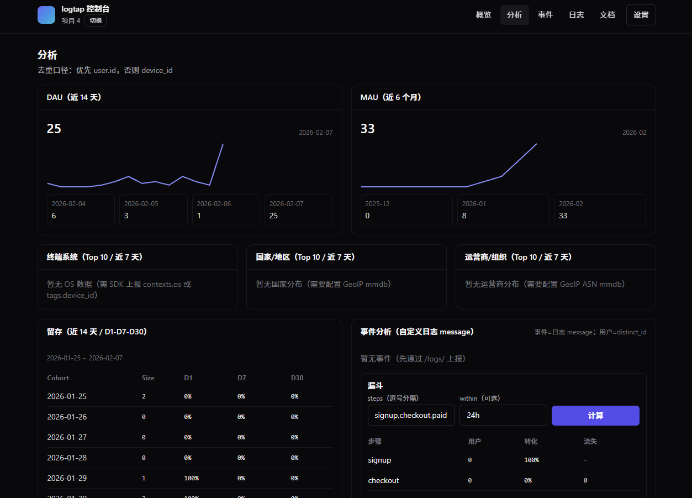
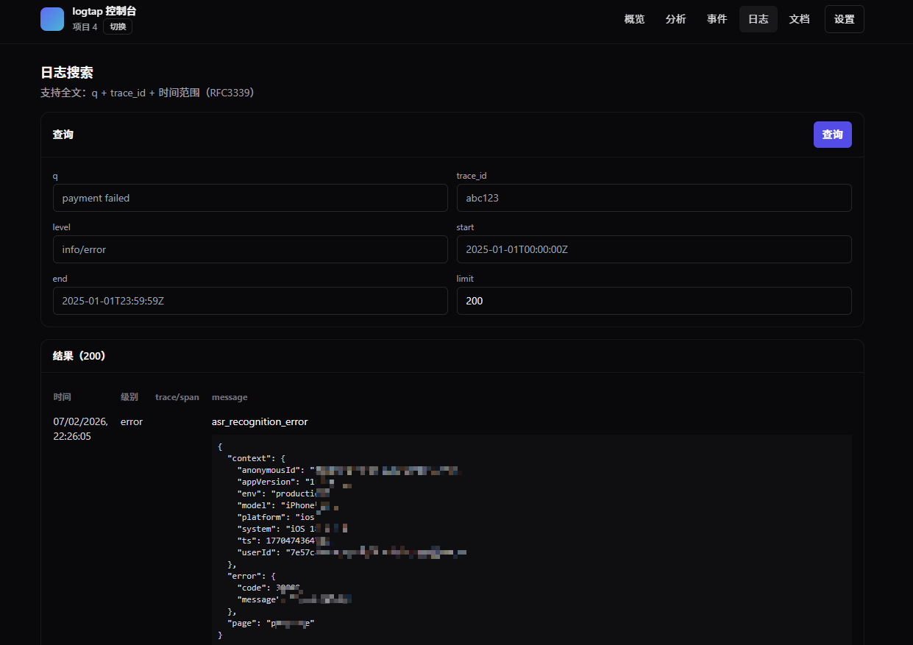

# logtap

English | [Chinese](README.zh-CN.md)

[](go.mod)
[](https://gin-gonic.com/)
[](https://www.postgresql.org/)
[](https://redis.io/)
[](web/)
[](web/)

A lightweight Sentry-compatible error reporting and structured logging gateway (Go + Gin + NSQ + TimescaleDB/Postgres).

Great for quickly setting up:
- Sentry SDK compatible error/event reporting (`/store` + `/envelope`)
- Structured log collection (batch + gzip) and search
- Basic analytics (DAU/MAU, distribution, retention, event top, funnel)

## Key Features

- Sentry compatible reporting: `/api/:projectId/store/`, `/api/:projectId/envelope/`
- Custom structured logs: `/api/:projectId/logs/` (batch JSON, gzip)
- Events/tracking: `/api/:projectId/track/` (for event top/funnel analysis)
- Async DB writes: HTTP → NSQ → consumer batch write to Postgres/Timescale
- Console: `web/` (React + Tailwind)
- Optional enhancements: Redis metrics/aggregation, GeoIP distribution

## Quick Start (Docker Compose)

Prerequisites: Docker + Docker Compose installed.

1) Generate `AUTH_SECRET` (base64, decoded length >= 32 bytes):
- Taskfile: `task auth:secret`
- Bash: `bash scripts/gen-auth-secret.sh`
- PowerShell: `powershell -ExecutionPolicy Bypass -File scripts/gen-auth-secret.ps1`

2) (Optional) Enable GeoIP (country/city/ASN distribution)
- Requires MaxMind GeoLite2 license key: set `MAXMIND_LICENSE_KEY` (see `.env.example`)
- Docker Compose will download mmdb to `/data/geoip/` at build/start (mounted as volume)

3) Start:

```bash
cd deploy
docker compose up --build
```

4) Access:
- API/Console: `http://localhost:8080`

## Screenshots




## Configuration (Environment Variables)

See `.env.example` for a complete example.

### Required

| Variable | Description | Default |
|----------|-------------|---------|
| `AUTH_SECRET` | **Required**. Secret for console login, project management, query auth. Base64 encoded, decoded length >= 32 bytes. See "Quick Start" for generation. | - |
| `NSQD_ADDRESS` | NSQd TCP address. Usually no need to change in Docker Compose. | `127.0.0.1:4150` |
| `POSTGRES_URL` | PostgreSQL connection string. Required when `RUN_CONSUMERS=true`. | - |

### Service Basics

| Variable | Description | Default |
|----------|-------------|---------|
| `HTTP_ADDR` | HTTP server listen address. | `:8080` |
| `NSQD_HTTP_ADDRESS` | NSQd HTTP address. Auto-derived from `NSQD_ADDRESS` (port+1) if empty. | Auto |
| `RUN_CONSUMERS` | Start NSQ consumers (DB writes). Set to `false` for API-only gateway. | `true` |
| `RUN_ALERT_WORKER` | Start alert worker. Set to `false` to enqueue alerts without delivery, run `alert-worker` separately. | `false` |
| `MAINTENANCE_MODE` | Maintenance mode. Rejects writes when `true`. Useful during DB migrations. | `false` |
| `ENABLE_DEBUG_ENDPOINTS` | Enable debug endpoints (pprof, etc.). | `false` |

### Database Connection

| Variable | Description | Default |
|----------|-------------|---------|
| `DB_REQUIRE_TIMESCALE` | Require TimescaleDB and create hypertables. Recommended for production. | `false` |
| `DB_MAX_OPEN_CONNS` | Max open DB connections. | `10` |
| `DB_MAX_IDLE_CONNS` | Max idle DB connections. | `1` |

### NSQ Consumer Tuning

| Variable | Description | Default |
|----------|-------------|---------|
| `NSQ_MAX_IN_FLIGHT` | Max in-flight messages. | `2000` |
| `NSQ_EVENT_CHANNEL` | Event consumer channel name. | `event-consumer` |
| `NSQ_LOG_CHANNEL` | Log consumer channel name. | `log-consumer` |
| `NSQ_EVENT_CONCURRENCY` | Event consumer concurrency. | `50` |
| `NSQ_LOG_CONCURRENCY` | Log consumer concurrency. | `200` |

### Batch Write Tuning

| Variable | Description | Default |
|----------|-------------|---------|
| `DB_LOG_BATCH_SIZE` | Log batch write size. | `500` |
| `DB_LOG_FLUSH_INTERVAL` | Log flush interval. | `20ms` |
| `DB_EVENT_BATCH_SIZE` | Event batch write size. | `200` |
| `DB_EVENT_FLUSH_INTERVAL` | Event flush interval. | `20ms` |

### Data Cleanup

| Variable | Description | Default |
|----------|-------------|---------|
| `CLEANUP_INTERVAL` | Cleanup task interval. | `10m` |
| `CLEANUP_POLICY_LIMIT` | Max policies per cleanup run. | `50` |
| `CLEANUP_DELETE_BATCH_SIZE` | Rows per delete batch. | `5000` |
| `CLEANUP_MAX_BATCHES` | Max batches (prevent long cleanup). | `50` |
| `CLEANUP_BATCH_SLEEP` | Sleep between batches. | `0s` |

### Redis (Optional)

| Variable | Description | Default |
|----------|-------------|---------|
| `REDIS_ADDR` | Redis address. Enables metrics aggregation and enhanced analytics. | - |
| `REDIS_PASSWORD` | Redis password. | - |
| `REDIS_DB` | Redis database number. | `0` |
| `ENABLE_METRICS` | Enable metrics (requires Redis). | `true` (when Redis available) |
| `METRICS_DAY_TTL` | Day-level metrics retention. | `4320h` (180 days) |
| `METRICS_DIST_TTL` | Distribution metrics retention. | `2160h` (90 days) |
| `METRICS_MONTH_TTL` | Month-level metrics retention. | `13392h` (~18 months) |

### GeoIP (Optional)

| Variable | Description | Default |
|----------|-------------|---------|
| `GEOIP_CITY_MMDB` | GeoIP City database path. Default in Docker: `/data/geoip/GeoLite2-City.mmdb`. | - |
| `GEOIP_ASN_MMDB` | GeoIP ASN database path. Default in Docker: `/data/geoip/GeoLite2-ASN.mmdb`. | - |
| `MAXMIND_LICENSE_KEY` | MaxMind license key (downloads GeoIP at build time). | - |

### Authentication & Session

| Variable | Description | Default |
|----------|-------------|---------|
| `AUTH_SECRET` | Auth secret (Base64, >= 32 bytes). | **Required** |
| `AUTH_SECRET_FILE` | Read auth secret from file (Docker Secret). | - |
| `AUTH_TOKEN_TTL` | Auth token TTL. | `168h` (7 days) |

### Alerting

#### Alert Worker

| Variable | Description | Default |
|----------|-------------|---------|
| `RUN_ALERT_WORKER` | Start alert delivery worker. | `false` |
| `ALERT_CLEANUP_INTERVAL` | Alert history cleanup interval. | `1h` |
| `ALERT_DELIVERIES_RETENTION_DAYS` | Alert delivery records retention days (0=disabled). | `0` |
| `ALERT_STATES_RETENTION_DAYS` | Alert state records retention days (0=disabled). | `0` |

#### Webhook SSRF Protection

| Variable | Description | Default |
|----------|-------------|---------|
| `WEBHOOK_ALLOW_LOOPBACK` | Allow webhook calls to loopback (127.0.0.1). For dev/test. | `false` |
| `WEBHOOK_ALLOW_PRIVATE_IPS` | Allow webhook calls to private IPs (10.x, 172.16-31.x, 192.168.x). | `false` |
| `WEBHOOK_ALLOWLIST_CIDRS` | Allowed CIDR list, comma/space separated. E.g., `10.0.0.0/8,192.168.0.0/16`. | - |

#### SMTP Email

| Variable | Description | Default |
|----------|-------------|---------|
| `SMTP_HOST` | SMTP server address. | - |
| `SMTP_PORT` | SMTP port. | `587` |
| `SMTP_FROM` | Sender email address. | - |
| `SMTP_USERNAME` | SMTP username. | - |
| `SMTP_PASSWORD` | SMTP password. | - |

#### SMS (Aliyun)

| Variable | Description | Default |
|----------|-------------|---------|
| `SMS_PROVIDER` | SMS provider: `aliyun` or `tencent`. | - |
| `ALIYUN_SMS_ACCESS_KEY_ID` | Aliyun AccessKey ID. | - |
| `ALIYUN_SMS_ACCESS_KEY_SECRET` | Aliyun AccessKey Secret. | - |
| `ALIYUN_SMS_SIGN_NAME` | SMS signature. | - |
| `ALIYUN_SMS_TEMPLATE_CODE` | SMS template code. | - |
| `ALIYUN_SMS_REGION` | Aliyun region. | `cn-hangzhou` |

#### SMS (Tencent Cloud)

| Variable | Description | Default |
|----------|-------------|---------|
| `TENCENT_SMS_SECRET_ID` | Tencent Cloud SecretId. | - |
| `TENCENT_SMS_SECRET_KEY` | Tencent Cloud SecretKey. | - |
| `TENCENT_SMS_APP_ID` | SMS AppId. | - |
| `TENCENT_SMS_SIGN_NAME` | SMS signature. | - |
| `TENCENT_SMS_TEMPLATE_ID` | SMS template ID. | - |
| `TENCENT_SMS_REGION` | Tencent Cloud region. | `ap-guangzhou` |

### Monitor Worker (Optional)

| Variable | Description | Default |
|----------|-------------|---------|
| `RUN_MONITOR_WORKER` | Start monitor worker (health checks, metrics). | `false` |
| `MONITOR_TICK_INTERVAL` | Monitor tick interval. | `2s` |
| `MONITOR_BATCH_SIZE` | Monitor batch size. | `20` |
| `MONITOR_LEASE_DURATION` | Monitor lease duration (distributed). | `60s` |

### Cloud Proxy (Optional)

| Variable | Description | Default |
|----------|-------------|---------|
| `LOGTAP_PROXY_SECRET` | Cloud proxy secret. When set, `/api/:projectId/*` requires `X-Logtap-Proxy-Secret` header. | - |

### Plugins (Optional)

| Variable | Description | Default |
|----------|-------------|---------|
| `DETECTOR_PLUGIN_DIRS` | Detector plugin directories, comma/space separated. | - |

## Documentation

- Overview: `docs/OVERVIEW.md`
- Deployment: `docs/DEPLOYMENT.md`
- Ingest protocol: `docs/INGEST.md`
- SDK quick start: `docs/SDKs.md` (spec: `docs/SDK_SPEC.md`)

OpenAPI after running:
- `GET /openapi.json`
- `GET /docs`

## Example Usage

```bash
LOGTAP_BASE="http://localhost:8080"
PROJECT_ID="1"
PROJECT_KEY="pk_xxx"

# Send log
curl -sS -X POST "$LOGTAP_BASE/api/$PROJECT_ID/logs/" \
  -H "Content-Type: application/json" \
  -H "X-Project-Key: $PROJECT_KEY" \
  -d '{"level":"info","message":"hello","fields":{"k":"v"}}'
```

## Development

- Backend: `task run` or `go run ./cmd/gateway`
- Frontend: `cd web && bun install && bun run dev` (or `npm install && npm run dev`)
