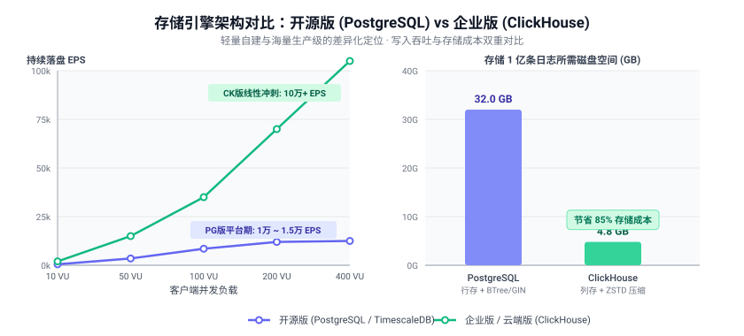
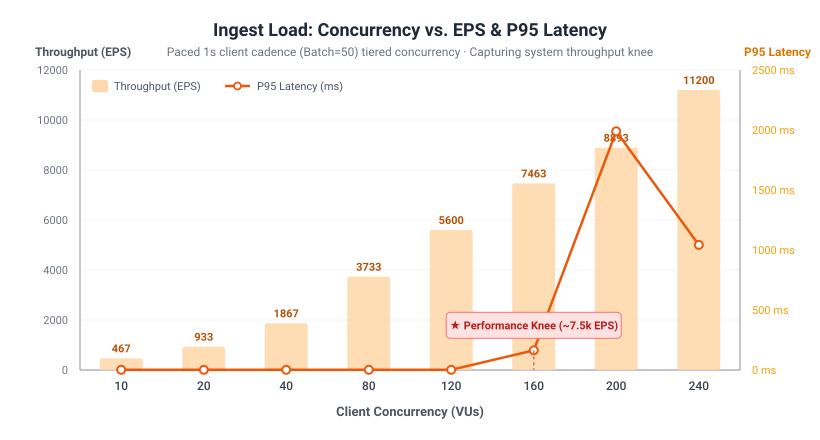
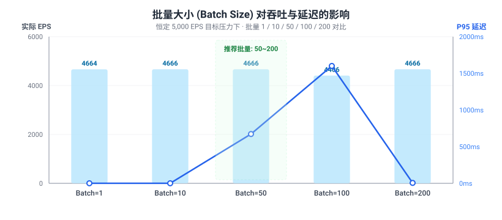
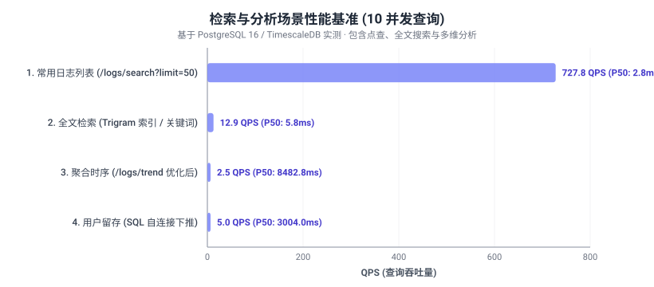

# 性能测试与基准画像 (Performance Benchmarks)

本文档定义了 `logtap` 的性能测试核心指标体系、双引擎版本定位（开源 PG 版 vs 企业 CK 版）、测试方法学以及在参考环境下的真实基准数据。

---

## 〇、架构分层与版本定位 (PostgreSQL vs ClickHouse)



- **开源版 (PostgreSQL / TimescaleDB)**：主打**零额外组件、运维极简**，为中小团队及单节点自建设计，持续稳定承载 **1万 ~ 2万 EPS**；
- **企业版 / 云端版 (ClickHouse)**：专为**海量高吞吐（10万 ~ 30万+ EPS）**设计，利用列式存储与 LSM 树批量极速落盘，并提供 5~10 倍极致数据压缩（节省 70%~85% 存储成本）与秒级多维分析能力。

---

## 一、性能测试核心指标体系

### 1. 写入场景 (日志采集 / 推送)
- **吞吐量**：EPS（Events Per Second，每秒日志条数）、字节吞吐量 (MB/s)
- **延迟**：P50 / P90 / P95 / P99 写入耗时（从客户端发起到服务端落盘/入队）
- **错误指标**：请求失败率、限流报错占比 (429)、超时率
- **压力变量**：并发客户端数 (VUs)、单条日志大小、批量大小 (Batch Size)

### 2. 查询 / 检索场景 (日志查询、SQL 分析)
- **查询延迟**：P50 / P90 / P95 / P99 查询耗时
- **查询 QPS**：每秒处理的查询请求数
- **扫描量**：每次查询扫描日志数据量（影响性能关键）
- **结果集大小**：返回行数 / 字节数

### 3. 消费场景 (消费组拉取日志)
- 消费吞吐 (MB/s)、消费堆积量 (NSQ Depth)

> **最佳实践**：**百分位延迟优先，不要只看平均值**，日志服务的长尾延迟（P95/P99）对上游推送客户端的稳定性至关重要。

---

## 二、基准测试结果与图表

测试环境：**单机 All-in-One**（gateway、PostgreSQL 16 / TimescaleDB、Redis 7、nsqd 1.2.1 同机部署），`DB_LOG_BATCH_SIZE=500`、flush 间隔 20ms。

### 1. 负载 - 性能曲线（阶梯并发压测，寻找性能拐点）

测试方式：每个客户端 (VU) 以严格 1 秒的恒定节奏发送请求（每请求 50 条日志，每个 VU 产生 50 EPS），阶梯加压至 240 VU。



| 并发数 (VUs) | 目标 EPS | 实际 EPS | P50 延迟 | P95 延迟 | P99 延迟 | 错误率 |
|---:|---:|---:|---:|---:|---:|---:|
| 10 | 500 | 467 | 1.5ms | 1.8ms | 2.4ms | 0.00% |
| 20 | 1,000 | 933 | 1.5ms | 1.9ms | 2.6ms | 0.00% |
| 40 | 2,000 | 1,867 | 1.4ms | 1.9ms | 3.3ms | 0.00% |
| 80 | 4,000 | 3,733 | 1.4ms | 1.8ms | 2.9ms | 0.00% |
| 120 | 6,000 | 5,600 | 1.4ms | 1.7ms | 2.8ms | 0.00% |
| **160 (性能拐点)** | 8,000 | **7,463** | **1.3ms** | **163.9ms** | 556.2ms | 0.00% |
| 200 | 10,000 | 8,893 | 478.9ms | 1,988.9ms | 2,310.5ms | 0.00% |
| 240 | 12,000 | 11,200 | 301.8ms | 1,042.4ms | 1,196.8ms | 0.00% |

- **拐点特征**：在 10 ~ 120 VU 范围内，EPS 随并发**严格线性上涨**，P95 始终极低（< 2ms）；到达 160 VU（约 7,500 EPS）后，P95 延迟出现拐点微升，200 VU 后延迟陡增至 1.9s，吞吐增长放缓进入平台期。

### 2. 批量大小 (Batch Size) 策略对比

在恒定 ~5,000 EPS 目标压力下，对比单条发送与不同攒批策略下的延迟与吞吐开销：



- **结论**：Batch Size 过小（如 1 或 10）会导致大量 HTTP 头部开销与网络往返；推荐客户端批量设置为 **50 ~ 200 条/请求**。

### 3. 检索与分析场景性能基准 (10 并发查询)

测试包含数十万级历史日志数据的数据库性能：



| 查询场景 | 接口 / 索引类型 | 稳定 QPS | P50 耗时 | P95 耗时 |
|---|---|---:|---:|---:|
| 常用日志列表点查 | `/logs/search?limit=50` (project_id + timestamp 倒序复合索引) | **727.8** | **2.8ms** | **4.3ms** |
| 关键词全文检索 | `/logs/search?q=...` (pg_trgm GIN 三元组索引优化) | **12.9** | **5.8ms** | **41.0ms** |
| 时序聚合统计 | `/logs/trend` (按小时聚合与 Top 错误) | **2.5** | 8.4s | 9.6s |
| 队列多维留存分析 | `/analytics/retention` (SQL 自连接下推) | **5.0** | 3.0s | 3.0s |

---

## 三、压测工具与脚本
## 依赖

- 安装 `k6`：https://k6.io/docs/get-started/installation/

## 变量

脚本使用环境变量：

- `BASE_URL`：服务地址（例如 `http://127.0.0.1:8080`）
- `PROJECT_ID`：项目 ID（例如 `1`）
- `PROJECT_KEY`：项目 key（用于 `X-Project-Key`）
- `BATCH_SIZE`：每个请求包含的条数（默认 `50`）
- `SLEEP_MS`：每次请求后的 sleep（默认 `0`）

k6 通用参数（示例）：
- `--vus 50 --duration 2m`

## 写入压测：logs

```
BASE_URL=http://127.0.0.1:8080 \
PROJECT_ID=1 \
PROJECT_KEY=pk_xxx \
BATCH_SIZE=50 \
k6 run --vus 50 --duration 2m docs/perf/k6_ingest_logs.js
```

## 写入压测：track

```
BASE_URL=http://127.0.0.1:8080 \
PROJECT_ID=1 \
PROJECT_KEY=pk_xxx \
BATCH_SIZE=50 \
k6 run --vus 50 --duration 2m docs/perf/k6_ingest_track.js
```

## 建议记录

- 网关：`p95/p99`、错误率（202/5xx）、CPU/内存
- NSQ：topic depth、重试率（超时/重投递）
- DB：insert 延迟、WAL、锁等待、CPU/IO
- Redis（如启用）：命令耗时与内存曲线


## 100 万日志 + 常用查询混合压测

脚本：`docs/perf/k6_ingest_and_query_1m.js`

覆盖两类负载：

- 写入：默认向 `/api/:projectId/logs/` 灌入 `1,000,000` 条日志，`INCLUDE_TRACK=true` 时额外按 10% 比例写 `/track/`。
- 查询：并发轮询常用查询接口，包括 `metrics/today`、`metrics/total`、`logs/search`、事件 top、用户增长、漏斗、自定义分析、存储估算、schema、cleanup、analysis views、alerts、monitors。

常用变量：

- `BASE_URL`：服务地址，例如 `http://<247-server>:8080`
- `PROJECT_ID`：项目 ID
- `PROJECT_KEY`：写入用项目 key；如果通过内网代理密钥访问可不填
- `AUTH_TOKEN`：查询用用户 JWT；如果用 `PROXY_SECRET` 可不填
- `PROXY_SECRET`：对应服务端 `LOGTAP_PROXY_SECRET`，同时可绕过写入 key 和查询用户 token
- `TARGET_LOGS`：写入日志总数，默认 `1000000`
- `BATCH_SIZE`：每个写入请求的日志条数，默认 `100`
- `INGEST_VUS`：写入并发，默认 `50`
- `QUERY_VUS`：查询并发，默认 `20`
- `QUERY_DURATION`：查询持续时间，默认 `5m`
- `RUN_ID`：压测批次标记，默认当前时间戳
- `INCLUDE_TRACK`：是否额外压测 `/track/`，默认 `false`
- `INCLUDE_REDIS_ANALYTICS`：是否额外压测依赖 Redis recorder 的 `active/dist/retention`，默认 `false`

示例：

```
BASE_URL=http://<247-server>:8080 \
PROJECT_ID=1 \
PROJECT_KEY=pk_xxx \
AUTH_TOKEN=eyJxxx \
TARGET_LOGS=1000000 \
BATCH_SIZE=100 \
INGEST_VUS=50 \
QUERY_VUS=20 \
QUERY_DURATION=10m \
k6 run docs/perf/k6_ingest_and_query_1m.js
```

如果 247 上的数据面启用了 `LOGTAP_PROXY_SECRET`，推荐直接用代理密钥跑，避免额外准备用户 token：

```
BASE_URL=http://<247-server>:8080 \
PROJECT_ID=1 \
PROXY_SECRET=proxy_secret_xxx \
TARGET_LOGS=1000000 \
k6 run docs/perf/k6_ingest_and_query_1m.js
```

建议记录：

- k6：`http_req_duration p95/p99`、`http_req_failed`、按 `endpoint` tag 分组的慢接口。
- 服务端：CPU、内存、goroutine、`/debug/metrics`、错误日志。
- DB：CPU/IO、慢 SQL、锁等待、索引命中、表/索引膨胀。
- 队列/消费者：NSQ topic depth、requeue、consumer 写入延迟；确认 100 万条最终入库后再看 rollup 统计。
