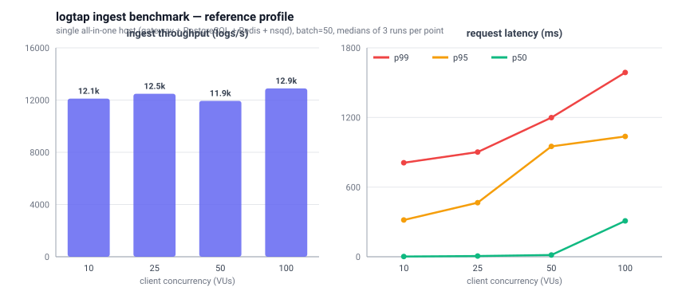

# 性能压测（k6）

目标：提供一套可重复的写入压测脚本，用于比较优化前/后的吞吐与延迟。

## 基准参考数据（2026-09）



参考环境：**单机 all-in-one**（gateway、PostgreSQL 16/TimescaleDB、Redis 7、nsqd 1.2.1 同机），`DB_LOG_BATCH_SIZE=500`、flush 间隔 20ms，每请求 50 条日志，每点 3 轮 × 15s 取中位数，轮次之间等待 NSQ 队列完全排空。

| 并发 (VUs) | 吞吐 (logs/s) | p50 | p95 | p99 |
|---:|---:|---:|---:|---:|
| 10 | 12,108 | 2ms | 317ms | 810ms |
| 25 | 12,483 | 6ms | 466ms | 902ms |
| 50 | 11,938 | 15ms | 951ms | 1,199ms |
| 100 | 12,892 | 309ms | 1,037ms | 1,588ms |

结论与注意事项（重要）：

- 摄入吞吐在约 **12k–13k logs/s** 进入平台期，尾部延迟（p95/p99）随客户端并发上升。这是消费与摄入共享单机资源时的参考画像，不是分布式部署上限。
- 测试宿主机为共享环境，**同版本单点波动可达 ±20–30%**。我们用「新旧版本逐点交替、配对比较」的方式做了多轮 A/B（含纯发布路径 `RUN_CONSUMERS=false` 的对照），差异始终落在波动范围内，因此本文档**只给出参考画像，不给出未经证实的优化前后百分比**。
- 优化本身是代码路径层面的（可从 diff 直接验证）：消除每条消息的规则查询与 JSON 重解析、单语句批量 advisory lock、EXPIRE 并入打点 pipeline、批量落库与积累重叠、NSQ producer 连接池（8 连接轮询）等。要在受控环境复测，请使用下方工具并保证：独占宿主机、client 与 server 同机、每轮之间排空队列。记录时建议同时采集 `/debug/vars`（expvar：`alert_engine_*` 等）与 nsqd `/stats` 的 `timeout_count`。

## 依赖

- 安装 `k6`：https://k6.io/docs/get-started/installation/

## 变量

脚本使用环境变量：

- `BASE_URL`：服务地址（例如 `http://127.0.0.1:8080`）
- `PROJECT_ID`：项目 ID（例如 `1`）
- `PROJECT_KEY`：项目 key（用于 `X-Project-Key`）
- `BATCH_SIZE`：每个请求包含的条数（默认 `50`）
- `SLEEP_MS`：每次请求后的 sleep（默认 `0`）

k6 通用参数（示例）：
- `--vus 50 --duration 2m`

## 写入压测：logs

```
BASE_URL=http://127.0.0.1:8080 \
PROJECT_ID=1 \
PROJECT_KEY=pk_xxx \
BATCH_SIZE=50 \
k6 run --vus 50 --duration 2m docs/perf/k6_ingest_logs.js
```

## 写入压测：track

```
BASE_URL=http://127.0.0.1:8080 \
PROJECT_ID=1 \
PROJECT_KEY=pk_xxx \
BATCH_SIZE=50 \
k6 run --vus 50 --duration 2m docs/perf/k6_ingest_track.js
```

## 建议记录

- 网关：`p95/p99`、错误率（202/5xx）、CPU/内存
- NSQ：topic depth、重试率（超时/重投递）
- DB：insert 延迟、WAL、锁等待、CPU/IO
- Redis（如启用）：命令耗时与内存曲线


## 100 万日志 + 常用查询混合压测

脚本：`docs/perf/k6_ingest_and_query_1m.js`

覆盖两类负载：

- 写入：默认向 `/api/:projectId/logs/` 灌入 `1,000,000` 条日志，`INCLUDE_TRACK=true` 时额外按 10% 比例写 `/track/`。
- 查询：并发轮询常用查询接口，包括 `metrics/today`、`metrics/total`、`logs/search`、事件 top、用户增长、漏斗、自定义分析、存储估算、schema、cleanup、analysis views、alerts、monitors。

常用变量：

- `BASE_URL`：服务地址，例如 `http://<247-server>:8080`
- `PROJECT_ID`：项目 ID
- `PROJECT_KEY`：写入用项目 key；如果通过内网代理密钥访问可不填
- `AUTH_TOKEN`：查询用用户 JWT；如果用 `PROXY_SECRET` 可不填
- `PROXY_SECRET`：对应服务端 `LOGTAP_PROXY_SECRET`，同时可绕过写入 key 和查询用户 token
- `TARGET_LOGS`：写入日志总数，默认 `1000000`
- `BATCH_SIZE`：每个写入请求的日志条数，默认 `100`
- `INGEST_VUS`：写入并发，默认 `50`
- `QUERY_VUS`：查询并发，默认 `20`
- `QUERY_DURATION`：查询持续时间，默认 `5m`
- `RUN_ID`：压测批次标记，默认当前时间戳
- `INCLUDE_TRACK`：是否额外压测 `/track/`，默认 `false`
- `INCLUDE_REDIS_ANALYTICS`：是否额外压测依赖 Redis recorder 的 `active/dist/retention`，默认 `false`

示例：

```
BASE_URL=http://<247-server>:8080 \
PROJECT_ID=1 \
PROJECT_KEY=pk_xxx \
AUTH_TOKEN=eyJxxx \
TARGET_LOGS=1000000 \
BATCH_SIZE=100 \
INGEST_VUS=50 \
QUERY_VUS=20 \
QUERY_DURATION=10m \
k6 run docs/perf/k6_ingest_and_query_1m.js
```

如果 247 上的数据面启用了 `LOGTAP_PROXY_SECRET`，推荐直接用代理密钥跑，避免额外准备用户 token：

```
BASE_URL=http://<247-server>:8080 \
PROJECT_ID=1 \
PROXY_SECRET=proxy_secret_xxx \
TARGET_LOGS=1000000 \
k6 run docs/perf/k6_ingest_and_query_1m.js
```

建议记录：

- k6：`http_req_duration p95/p99`、`http_req_failed`、按 `endpoint` tag 分组的慢接口。
- 服务端：CPU、内存、goroutine、`/debug/metrics`、错误日志。
- DB：CPU/IO、慢 SQL、锁等待、索引命中、表/索引膨胀。
- 队列/消费者：NSQ topic depth、requeue、consumer 写入延迟；确认 100 万条最终入库后再看 rollup 统计。
